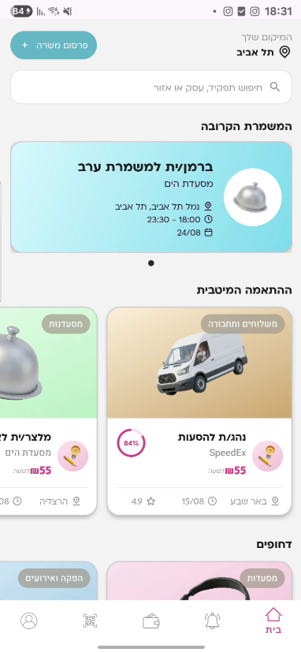
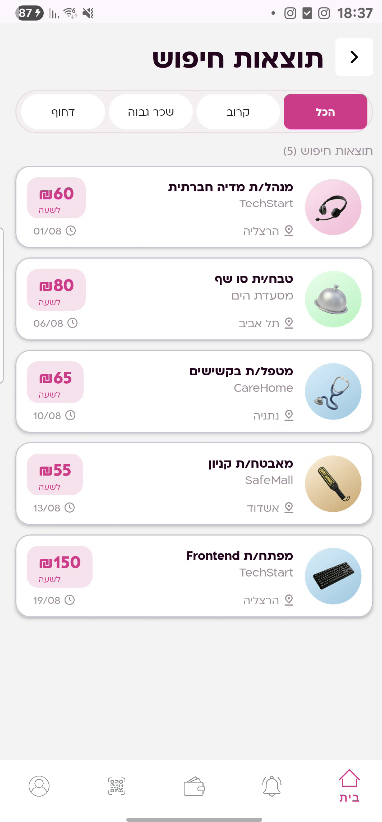
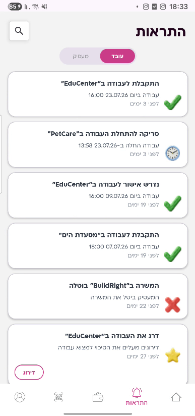
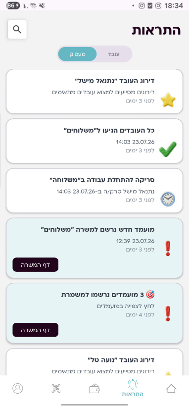
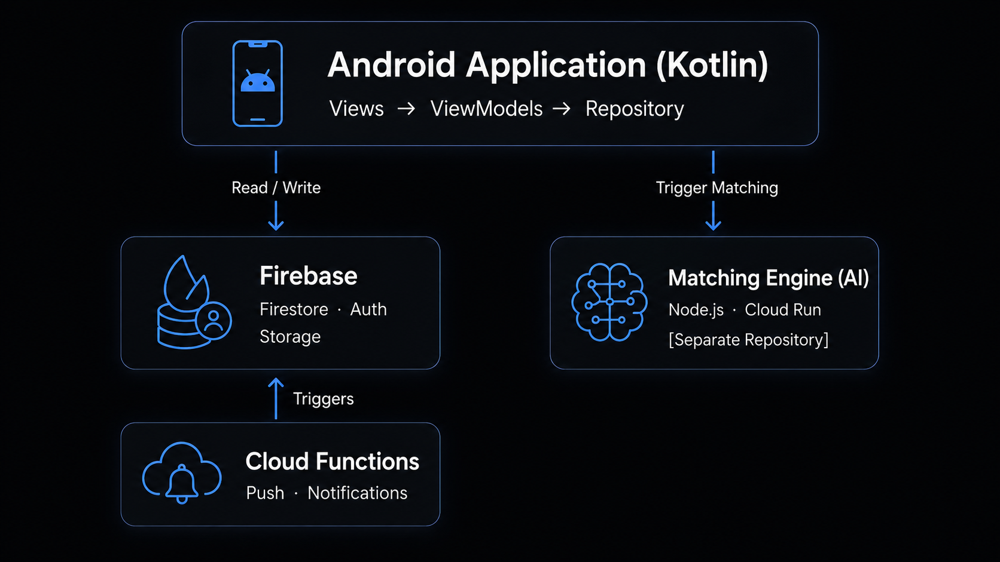

<div align="center">

# ClickJob

**An AI-powered platform for matching students with short-term, on-demand jobs**


</div>

ClickJob is an Android application that connects students looking for short-term, on-demand work with employers who need temporary staff. At the heart of the system is an **AI-powered matching engine** that analyzes the user's profile — skills, availability, interests, and résumé — and ranks the most relevant jobs for them, replacing manual search.

The system unifies two roles in a single account — **Worker** and **Employer** — with seamless switching between them, and guides both sides through the entire process: from discovering a job, through application and confirmation, to on-site check-in and mutual rating.

> 🧠 &nbsp;The AI matching engine is maintained in a separate repository → **[Matching Engine](https://github.com/natim1997/Final_Project_Jobs)**

---

## Key Features

🎯 &nbsp;**AI-Powered Matching** — an external engine ranks jobs by the user's profile instead of manual search.

👥 &nbsp;**Dual-Role System** — worker and employer in the same account, each with its own interface, dynamic theming, and workflow.

🔔 &nbsp;**Real-Time Push Notifications** — delivered to the device even when the app is closed, for every event: new applicant, confirmation, cancellation,           arrival, and rating request.

📷 &nbsp;**QR Shift Check-In** — scanning a code confirms on-site arrival in real time, with an automatic update to both sides.

⭐ &nbsp;**Mutual Rating** — workers and employers rate each other after a shift; the rating feeds back into the system and improves future match quality.

📄 &nbsp;**Résumé Management** — upload a PDF from which the engine extracts the user's profile.

🔄 &nbsp;**Real-Time Updates** — key screens update live through Firestore snapshot listeners, with no manual refresh.

---

## User Flow

| # | Step | Description |
|:---:|---|---|
| 1 | **Sign Up** | Create an account with strong-password validation |
| 2 | **Build Profile** | Personal details, skills, availability, and résumé upload |
| 3 | **Discover Jobs** | The home screen shows urgent jobs and the engine's top matches |
| 4 | **Search & Apply** | Search by category, view job details, and apply |
| 5 | **Sort Applicants** | The employer views and sorts applicants in real time |
| 6 | **Two-Step Confirmation** | The employer approves an applicant, and the worker confirms back |
| 7 | **Arrival Check-In** | The worker scans a QR code at the start of the shift |
| 8 | **Mutual Rating** | Both sides rate each other at the end |

---

## Screenshots

| Home | Job Details |
|:---:|:---:|
|  |  |

**Notifications — the same screen adapts to each role:**

| Worker | Employer |
|:---:|:---:|
|  |  |

---

## Architecture

The app follows the **MVVM** pattern, separating the view layer, the ViewModels, and the data layer (Repository). It communicates directly with Firestore for most operations, while sensitive logic is moved to the server side.

<div align="center">

</div>

**Splitting responsibility between client and server** is the central design decision: routine operations (reading jobs, applying, managing a profile) run directly against Firestore — fast and simple. But sensitive logic — creating notifications, sending push, and generating rating requests — was intentionally moved to **Cloud Functions**, because code that runs on the device can be bypassed, and the server side guarantees that a client cannot forge actions on behalf of another user.

**The two core flows:**

```
Matching:       Update profile / post a job
                → MatchingService triggers the engine (Cloud Run)
                → the engine computes and ranks
                → results are saved to Firestore
                → the app displays the matches

Notifications:  An app action (apply / confirm / scan)
                → a document is created in Firestore
                → a Cloud Function detects it and sends push via FCM
```

---

## Matching Engine

The core of the system is an AI-powered matching engine, running as a separate service in **Node.js on Google Cloud Run** and maintained in a **separate repository**.

The app is responsible for **triggering and display**: through `MatchingService`, it invokes the engine at two points — when a profile is updated (`triggerCandidateMatching`) and when a job is posted (`triggerJobMatching`). The engine computes the matches in the background, writes them to Firestore, and the app reads and displays them as a ranked list. This clean separation lets each side evolve independently.

> 🧠 &nbsp;Full details on the matching algorithm and profile analysis — in the **[Matching Engine repo](https://github.com/natim1997/Final_Project_Jobs)**.

---

## Security

Security was treated as a core layer, guided by one principle: **in a Firebase app, where the client talks to the database directly, the security rules *are* the server — they are the only layer that truly enforces.**

- **Firestore Rules** — applications are readable only by the worker and employer involved; the users collection cannot be bulk-listed; cross-user writes are limited to specific fields only.
- **Server-Side Responsibility** — sensitive writes (notifications, rating requests) run in Cloud Functions with full privileges, so a client cannot forge them.
- **Storage Rules** — files are isolated per user, and uploads are restricted to PDF only.
- **Endpoint Protection** — the matching service is protected by a server-side authentication layer.

---

## Tech Stack

| Layer | Tools |
|---|---|
| **Client** | Kotlin · XML + ViewBinding · MVVM · Navigation Component · CameraX · ZXing |
| **Backend** | Firebase Authentication · Cloud Firestore · Storage · Cloud Messaging · Cloud Functions (Node.js) |
| **AI** | Matching Engine — Node.js on Google Cloud Run `[separate repo]` |

---

## Getting Started

**Requirements:** Android Studio · JDK 17 · Node.js 18+ · a Firebase project

**1.** Clone the repo:
\`\`\`bash
git clone https://github.com/galDeri23/ClickJob_FinalProject.git
\`\`\`

**2.** Create a project in the [Firebase Console](https://console.firebase.google.com) with Authentication · Firestore · Storage · Cloud Messaging enabled, and add an Android app with the package \`com.example.clickjob_finalproject\`.

**3.** Download \`google-services.json\` and place it in the \`app/\` directory.

**4.** Deploy the Cloud Functions (requires the Blaze plan):
\`\`\`bash
cd functions && npm install
firebase deploy --only functions
\`\`\`

**5.** In \`MatchingService.kt\`, set the matching-engine endpoint (see the **[Matching Engine repo](https://github.com/natim1997/Final_Project_Jobs)**).

**6.** Open in Android Studio, wait for the Gradle sync, and click **Run** ▶.

> Minimum requirement: Android 9.0 (API 29).

---

## Team

- [Gal Deri](https://github.com/galDeri23)
- [Netanel Michel](https://github.com/natim1997)

---
